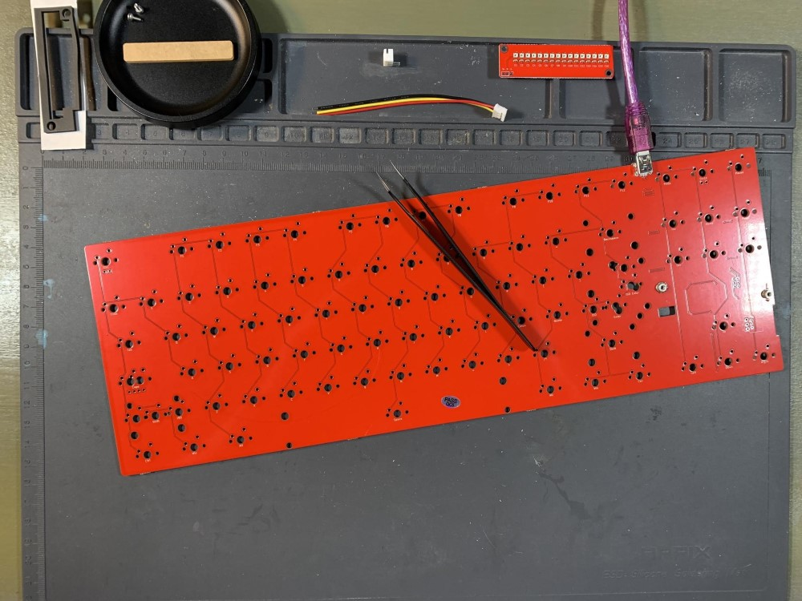
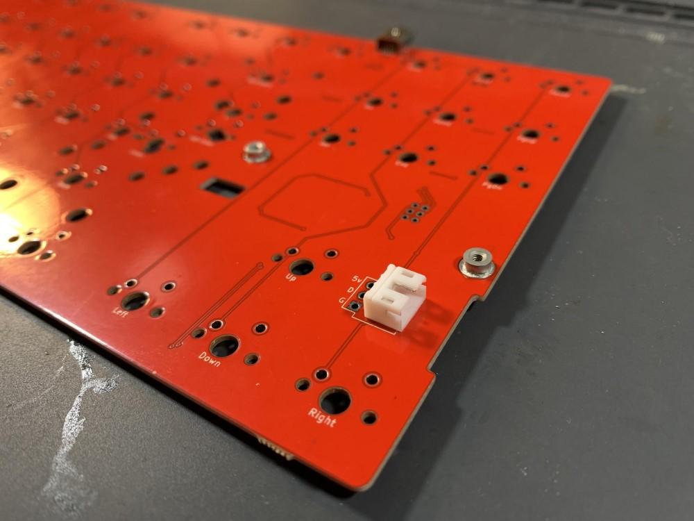
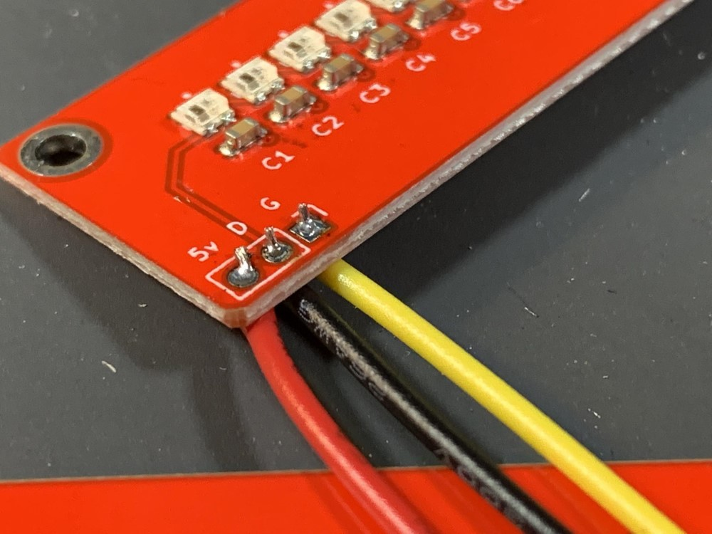
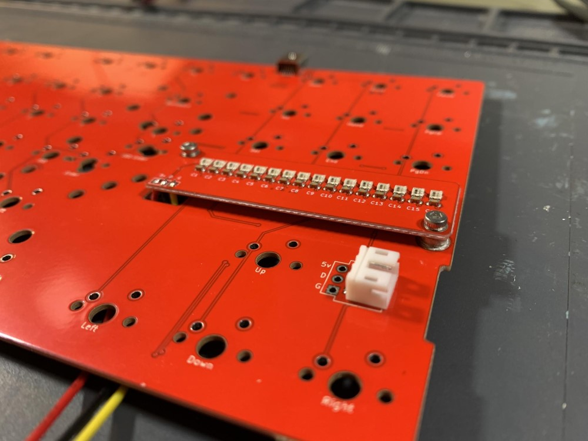
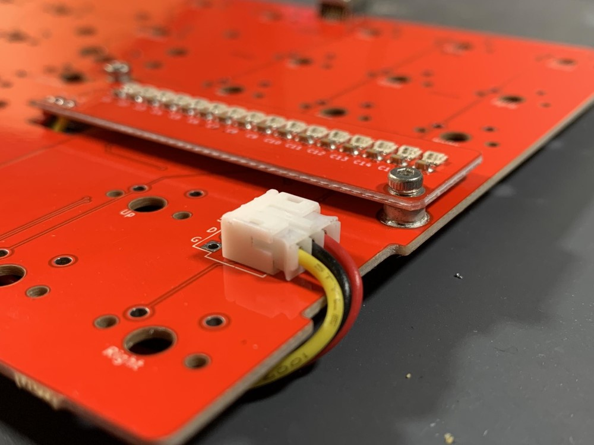
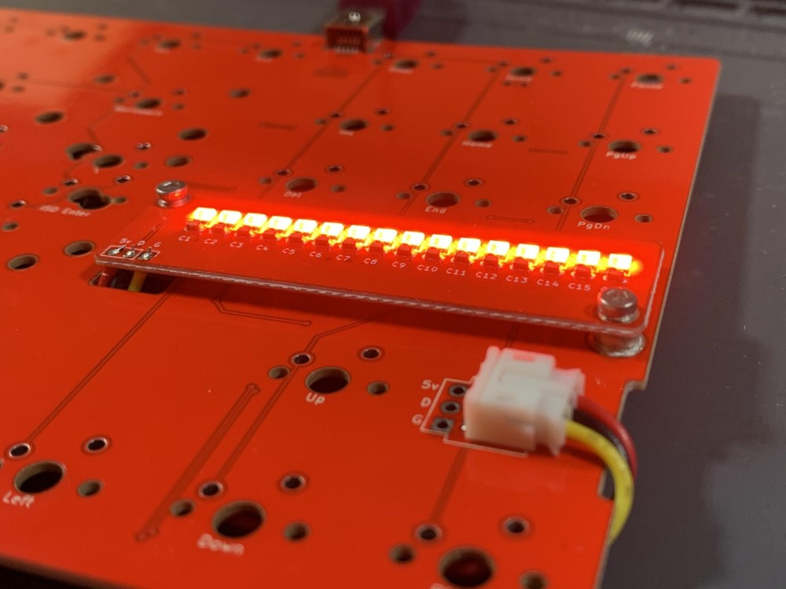
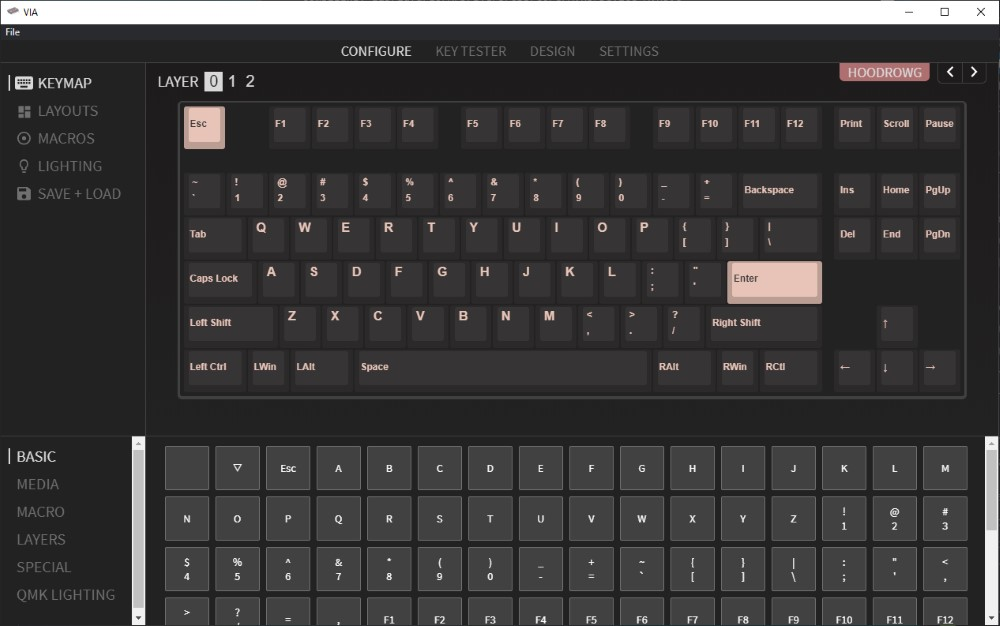
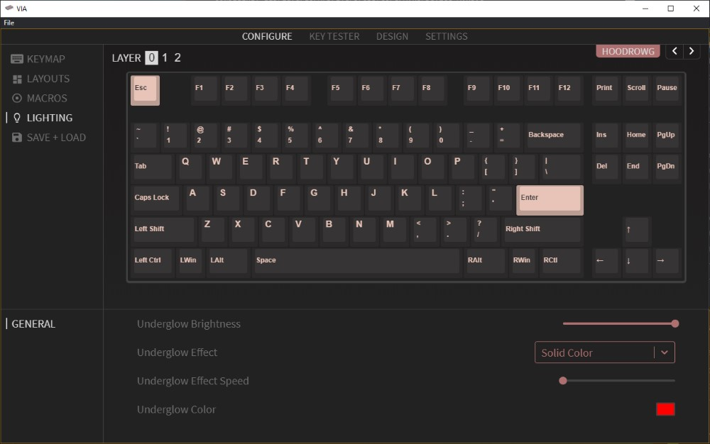

# HoodrowG PCB Assembly and User Guide
First, gather all the items and lay them out on your work area to make sure you have everything needed:

 - HoodrowG PCB
 - 2x screws
 - 1x JST Header
 - 1x Frosted Diffuser
 - 1x JST Cable
 - 1x Lightbar Daughterboard
 - 1x Foam Piece
 - Stabilizer Shims

*You can set aside the diffuser, foam, and stabilizer shims. Those are used last. In addition to the above, you will also need a soldering iron and solder.*

## Firmware Notice
The PCB ships with useable firmware to test functionality, however for full via support you will be required to flash new firmware. It is recommended to follow this guide, and download the required files before starting.

 - [HoodrowG Firmware](assets/cannonkeys_hoodrowg_via.hex)
 - [QMK Toolbox (To flash firmware)](https://github.com/qmk/qmk_toolbox/releases)
 - [VIA Program (Recommended)](https://github.com/the-via/releases/releases/tag/v1.3.1)

## Building the PCB

 1. Test the PCB using tweezers.
 

2. Insert the JST header as shown below.

3. Carefully solder the header in.

4. Insert the wires into the daughterboard from the underside, and solder them carefully. **The order of the wires matter.**

5. Screw the daughterboard into the standoffs using the included screws. Make sure to guide the wires through the hole in the PCB before fully tightening.

6. Guide the wire attached to the daughterboard along the underside of the PCB, utilizing the small cutout in the side of the PCB to plug the JST cable into the header soldered in step 3.

7. Make sure everything is soldered properly with no bridging, and the JST cable is snugly inserted. Once confirmed, plug the PCB into the computer. You should immediately see the lightbar light up.
 

 8. Using QMK Toolbox, flash the [HoodrowG firmware file](assets/cannonkeys_hoodrowg_via.hex) found above. In order to easily enter bootloader mode, press the black reset button found on the underside of PCB, directly opposite the daughterboard.

8. Once flashed successfully, unplug the PCB, then plug back in.

9. Navigate to the configure tab, you should see the PCB now viewable in the configure tab! At this point you can now remap your keyboard in real time using VIA. It is recommended to save your layout using the interface once you have your layout setup. This will allow you to quickly access your current layout should you want to change something.

10. To change the lighting in real time using the interface, navigate to the lighting tab, and using the dropdowns and color selector you can adjust the lightbar functionality! This can also be done with hotkeys using the configurator. 

11. At this point your PCB is fully configurable using VIA, and you should be able to drop it into your 1.2og keyboard. Use the included foam and diffuser as you would the standard one from Matrix to finish assembly.  Should you need further assistance, you can reach out our support via the widget on our main site, or the build help channel in our [Discord Server](https://discord.gg/Jm3sN7N6SN).
