# AN-C

## Default Layouts and Firmware

The layout shown is as it looks in VIA. Due to a VIA limitation, all keys are shown, even if you choose not to use them.

[Default Firmware](assets/cannonkeys_an_c_via.bin)

* Layer 0

* Layer 1

## Using VIA

VIA configurator is a graphical tool that can be used to change keymaps. It is available here: https://github.com/olivia/via-config/releases/

You must use a release later than v0.3.5

To change the keymap, simply open VIA Configurator and it will load the keyboard. If it does not work, restart VIA. From there, it's intuitive to change keys.

## Building Firmware

### Easy Option

!!! Notice
    There is a known bug with QMK Configurator which should be fixed in the upcoming weeks which causes it to build improper bin files. 

The easy option to create firmware is to use [QMK Configurator](https://config.qmk.fm/#/cannonkeys/an_c/LAYOUT_ansi).
This will give you a graphical interface for creating your desired keymap.

### More Hands-on Option

If you'd like to customize more than just a keymap, the best place to start is the [QMK Newbs Guide](https://docs.qmk.fm/#/newbs).
Follow the guide up until the flashing portion, and then follow the flashing guide below.

## Flashing
### One Time Setup 

Once the steps in this section are done once, they will not have to be done again, unless your driver resets.

1. Install the newest release of Zadig from [https://zadig.akeo.ie/](https://zadig.akeo.ie/).
1. Download the newest release of QMK Toolbox from [https://github.com/qmk/qmk_toolbox/releases](https://github.com/qmk/qmk_toolbox/releases)
1. Change the switch to "1" on the PCB
    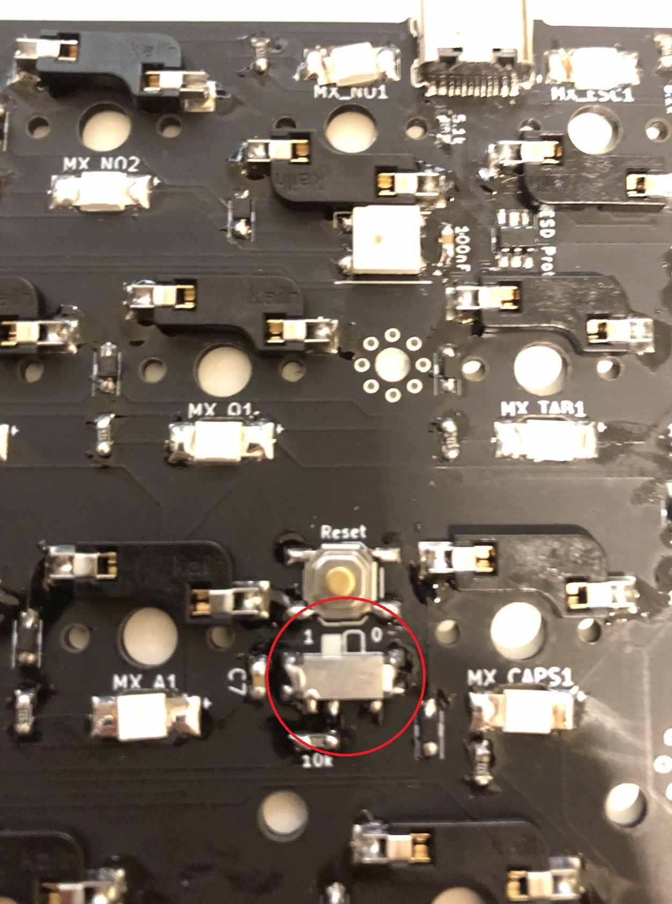
1. Plug the PCB in
    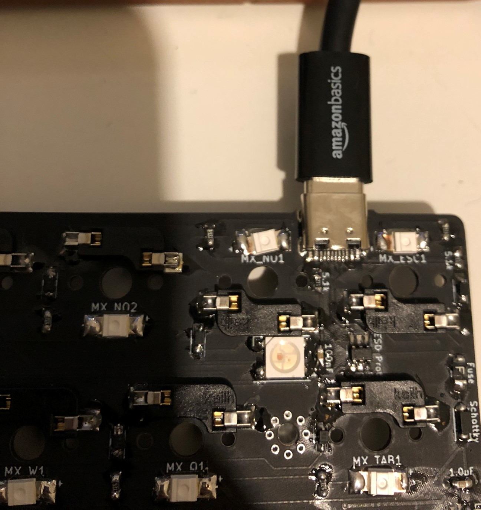
1. Open Zadig
    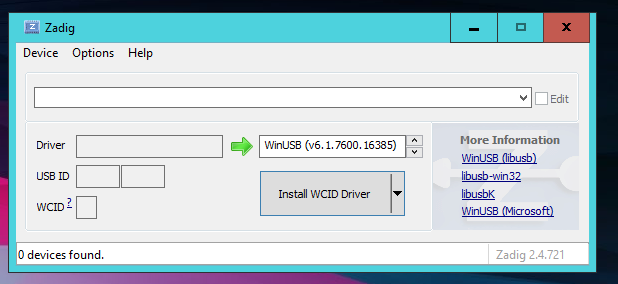
1. Click "List all Devices" in the Options menu
    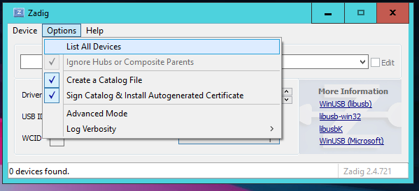
1. Select "STM32 BOOTLOADER" from the device dropdown
    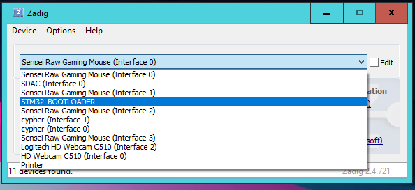
1. Select WinUSB from the Driver dropdown
    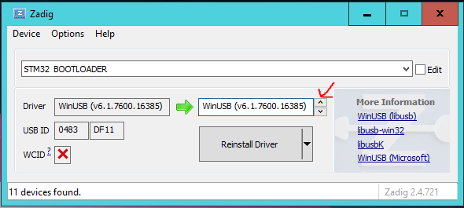
1. Click the 'Replace Driver' Button
    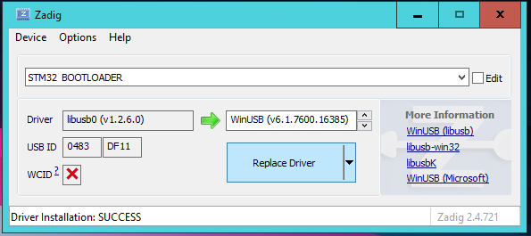
1. You should see a "Installing Driver" progress bar appear
    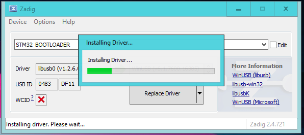

### Flashing

After initial setup has been done once, you can use the RESET keycode in QMK to enter flashing mode on your PCB. From there:

1. Download the proper firmware for your PCB
1. Start QMK Toolbox, and click the "Open" buttom
    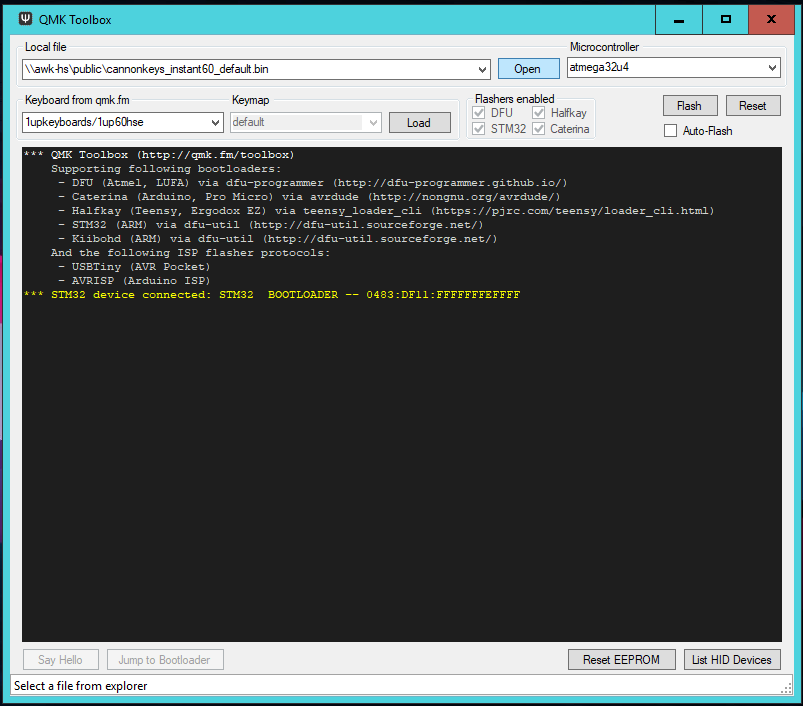
1. Change the filetype dropdown to ".bin" and select the proper firmware
    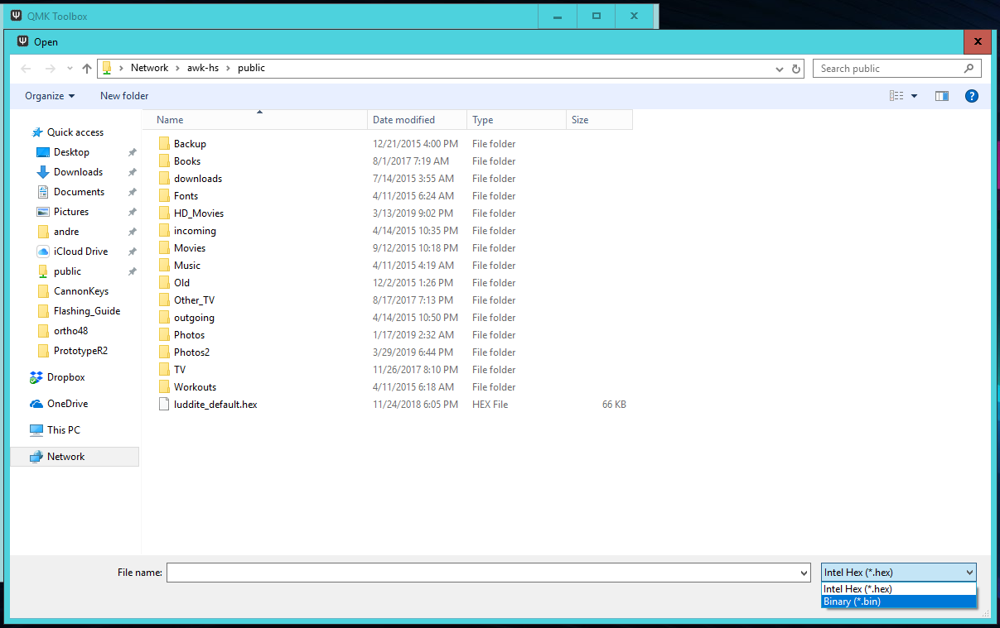
1. Hit the "Flash" Button
    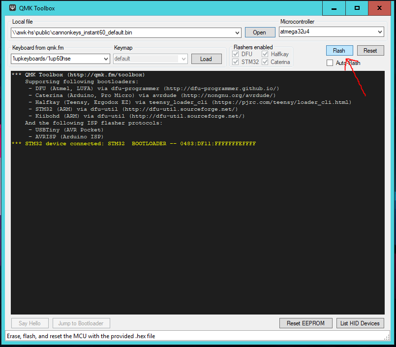
1. At the end, you should see "File downloaded successfully"
1. Change the switch back to "0" and hit the reset button
    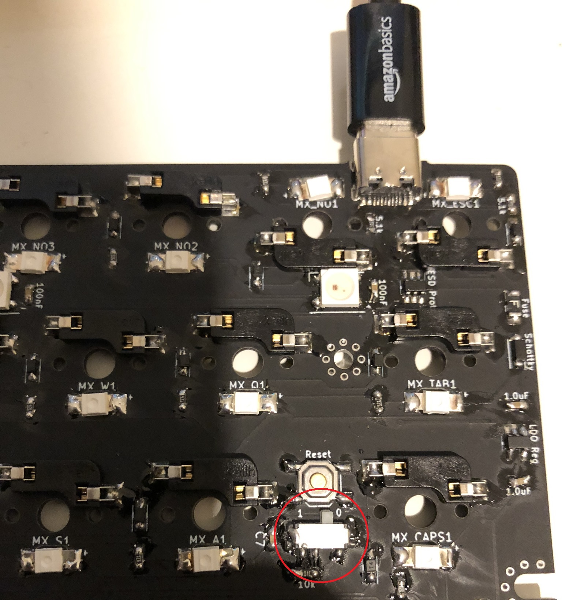
1. Verify all the LEDs work
    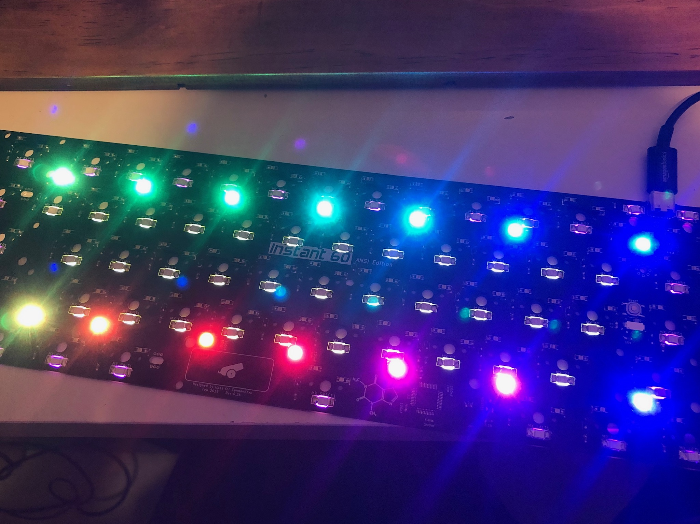
