# BakenekoGO Keymap Editing and Flash Guide
In this guide, you will learn how to remap keys on your BakenekoGO. This is a temporary solution while we wait for the VIA-like ZMK Studio to finish development.

## Requirements and links

 - [A GitHub account](https://github.com/)
 - [ZMK Keymap Editor GUI](https://nickcoutsos.github.io/keymap-editor/)
 - [CannonKeys zmk-config repo](https://github.com/cannonkeys/zmk-config)
 - (Optional) List of [ZMK key behaviors](https://zmk.dev/docs/behaviors)
 - (Optional) List of [ZMK key codes](https://zmk.dev/docs/codes)

*Note: This guide jumps between GitHub and the Keymap Editor site, this process goes smoothest when both tabs are kept open throughout the guide.*

### Video Guide
We have put together a video guide that you can use to go through these steps and help you understand the written guide. The video can be found [here](https://cannonkeys.com/pages/bakenekogo-flash-remap-video-guide).
 
### Background Info and Terminology
 In this guide, you will need to navigate a few steps in GitHub. To assist with this, let's go over a few key terms that will be used in the guide.
 
 - Repo - Short for repository. This is where code is stored.
 - Fork - A clone of a repo that is attached to your own GitHub account.
 - Forking - The act of cloning a repo someone else has created and attach it to your own GitHub account.

## Part 1: Linking Your GitHub and Forking ZMK-Config
In this section, we will go over the initial steps you will need to perform to get remapping setup. Once you go through part 1 and 2, you can start from part 3 for all future remaps!

1. Let's start by linking your GitHub account to the ZMK configurator website. Navigate to the [keymap editor website](https://nickcoutsos.github.io/keymap-editor/), and click the GitHub icon to link your GitHub account to this site.
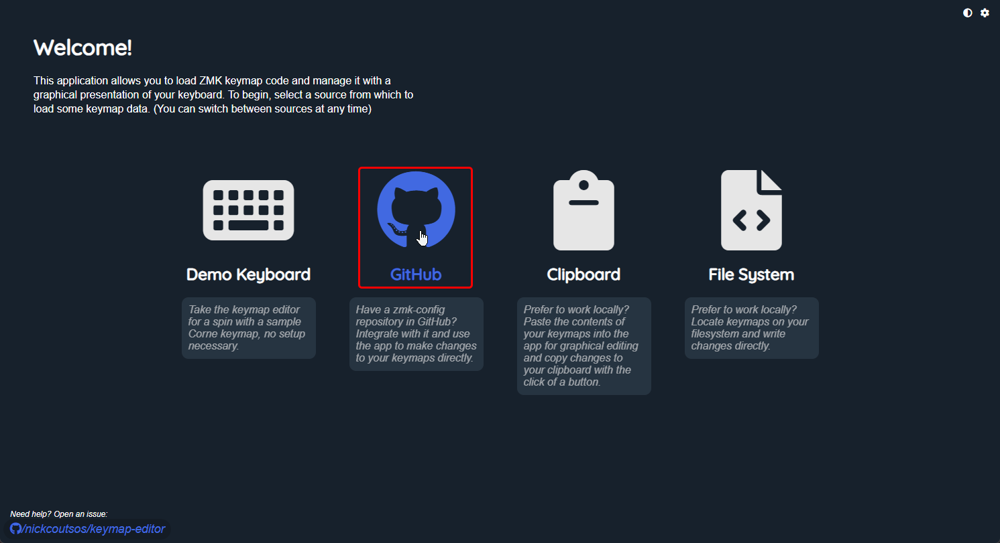
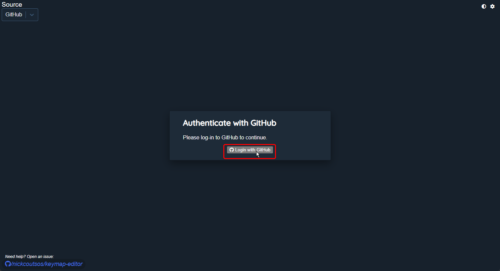

2. Select the GitHub account you plan on using for this. Your GitHub account should now be linked to the keymap editor!
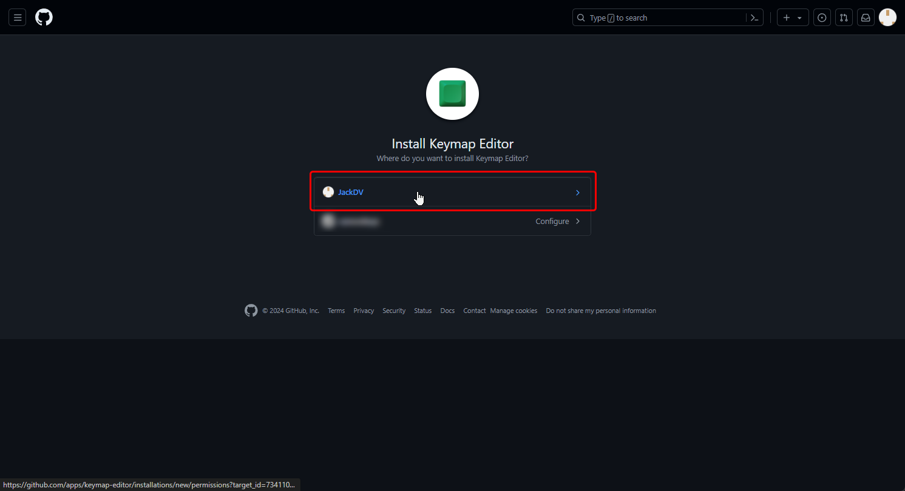

3. Keep the configurator page open, but in a new tab/window log into your GitHub account, and navigate to the [CannonKeys zmk-config repo](https://github.com/cannonkeys/zmk-config). Click the fork button in the top right of your screen.
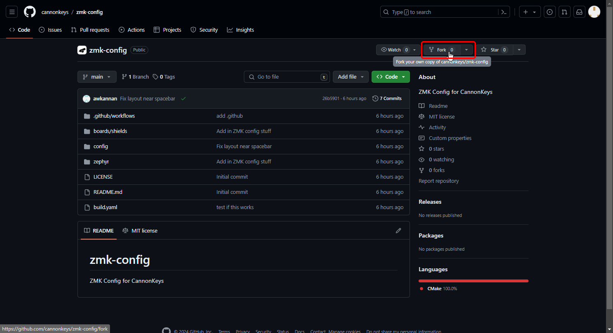

4. Click the green create fork button to clone the repo to your github account. Once pressed, give GitHub a moment to clone the code, and you will now have your own copy attached to your personal GitHub account.
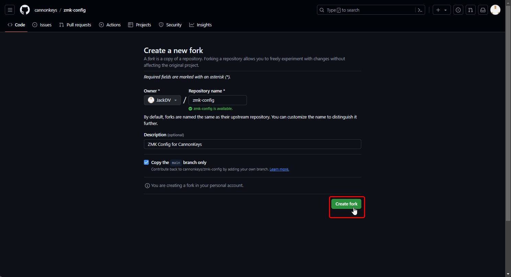

## Part 2: Adding Your Repo to the Configurator

1. Now that you have successfully forked the zmk-config repo and linked your GitHub account to the configurator, we need to add the zmk-config repo that is on your GitHub account to the [configurator](https://nickcoutsos.github.io/keymap-editor/).
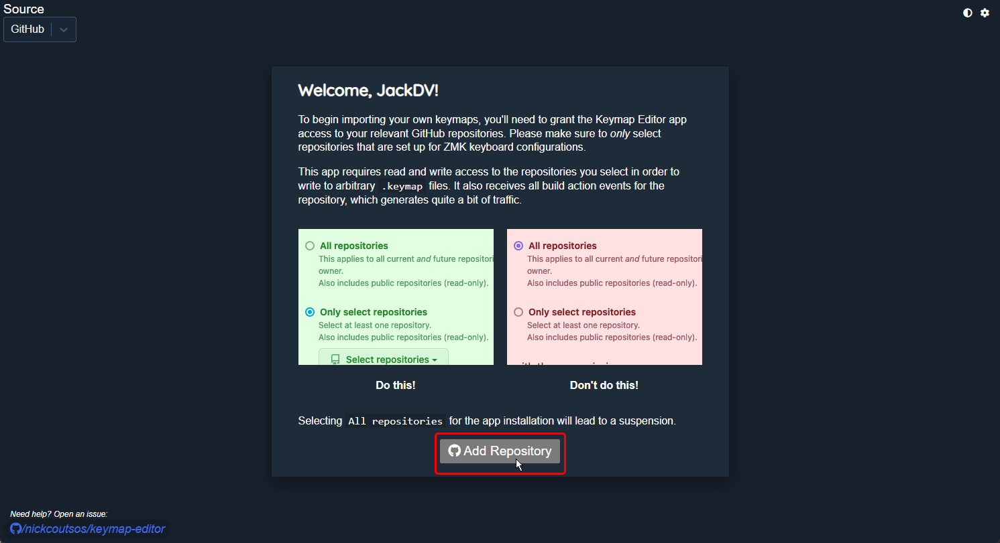

2. Tick the "Only select repositories button, and using the drop down menu, select the zmk-config repo. Even if it is your only repo, please use the "Only select repositories" option and select the repo.
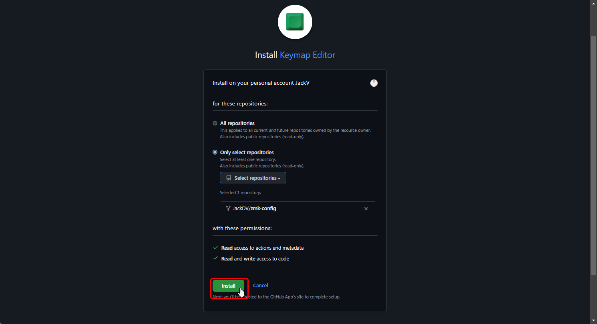

3. Once the installation has completed, the BakenekoGO Keymap should be visible on your screen!

## Part 3: Changing Your Keymap and Compiling Firmware

If you have forked the CannonKeys zmk-config repo in the past, and already connected your GitHub account to the keymap editor, you can start here!

1.  Pull up the [ZMK Keymap Editor](https://nickcoutsos.github.io/keymap-editor/) in your browser. If your GitHub account was successfully linked, the BakenekoGO keymap should be visible. For the purposes of this guide, we will be remapping the Capslock key to be a Layer/FN key.

2. Click the key you wish to remap.
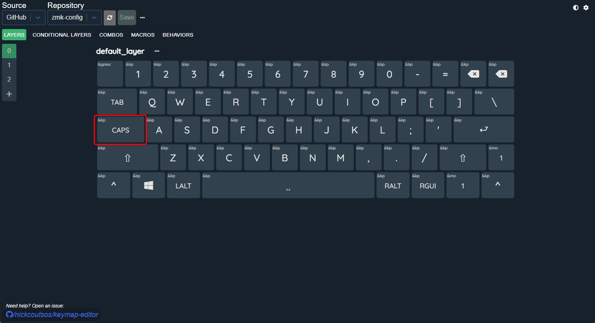

3. A dialogue box will pop up. The top option is where you decide what type of action you want this key to do. This is referred to as the [key behavior](https://zmk.dev/docs/behaviors). The bottom dropdown is where you set the new keybind. You can find a list of keycodes [here](https://zmk.dev/docs/codes), or you can use the interface in the editor to search. We have some basics listed in our [user guide](bakenekogo-user-guide.md) if you need help.
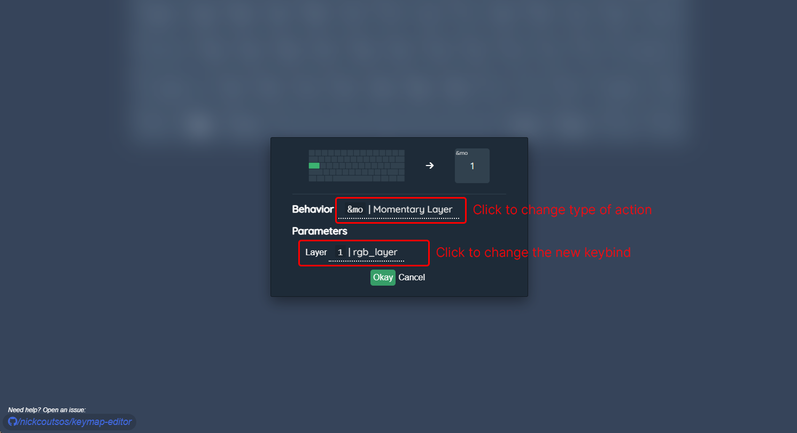

4. Once you have set your keybind options, press okay to apply them to your keymap. Repeat this for all keymap changes you wish to make!

5. Once you have finished making your keymap changes, press the save button. This will apply the keymap you have just created to your GitHub repo.

6. Add a note so you can track your keymap changes.
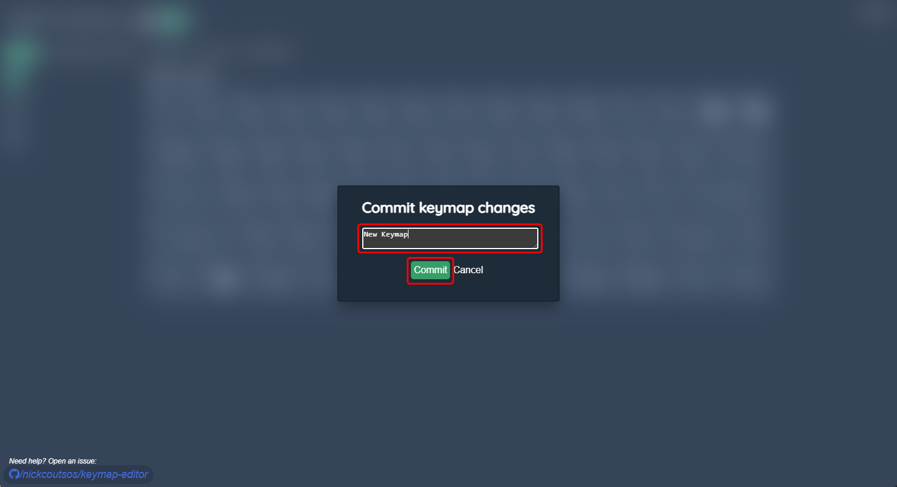

7. You have now created a new keymap, and applied the changes to your GitHub account! This process can take a minute or two, so give it a moment, and then, navigate to your own zmk-config repo on GitHub. This link will likely be `github.com/yourusername/zmk-config`. You can tell your changes were applied if you see a recent change in your repo. Click on the actions button. 
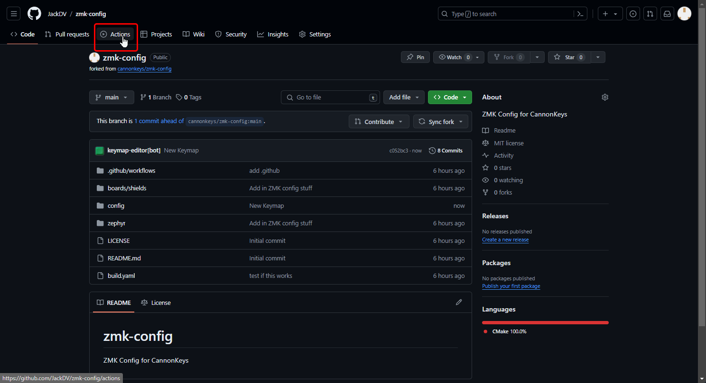

8. If it pops up, press the green "I Understand..." button, and then once on the actions page click on the `.github/workflows/build.yml` workflow in the actions column.
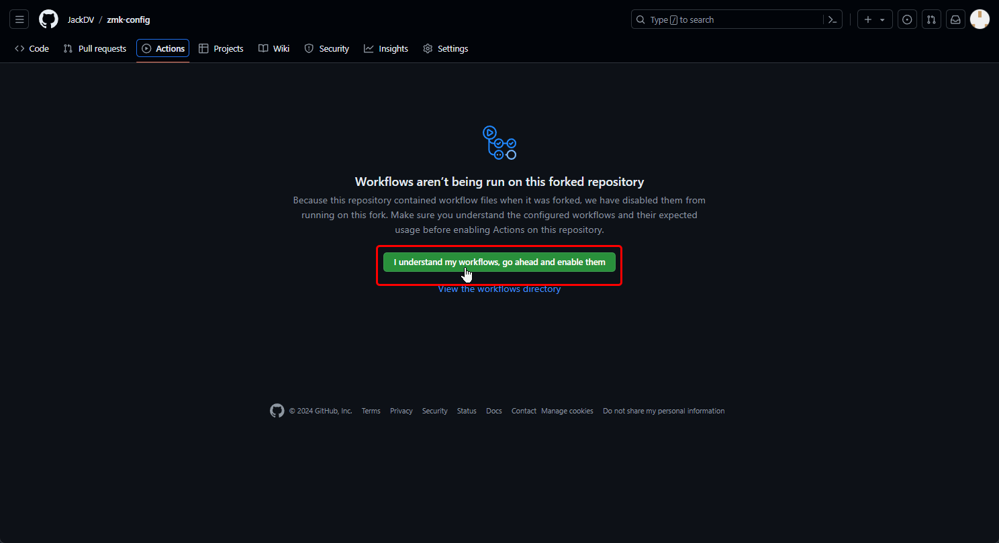
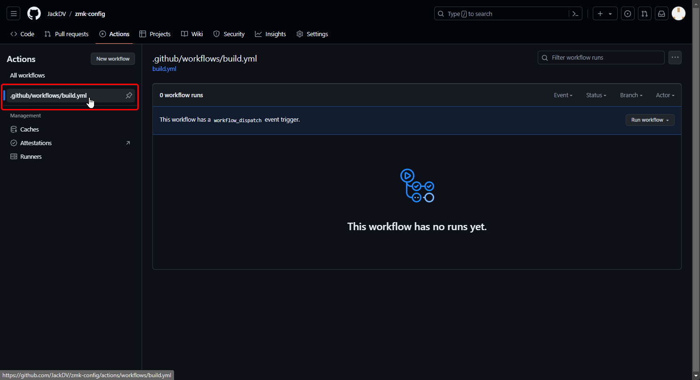

9. Click on the Run Workflow button in the top right of your screen. This will start the workflow that will compile a new firmware based on the changes you made and applied in the keymap editor earlier on in this guide.
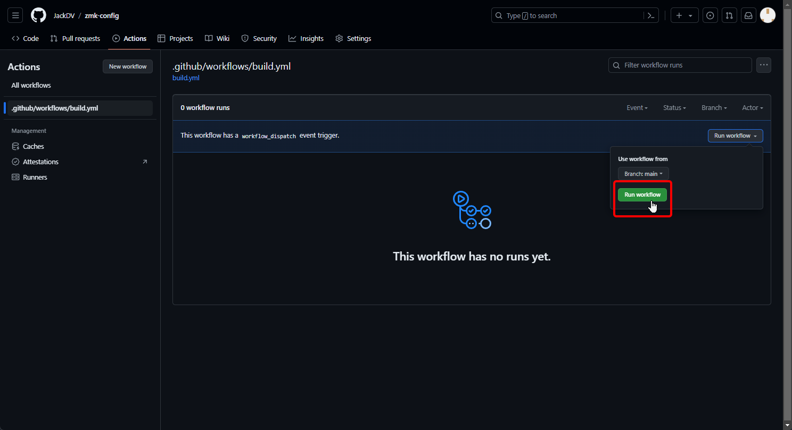

10. If you wish to track progress, you can click on the workflow. This process takes around 5-6 minutes, you don't need to monitor it while it's working.
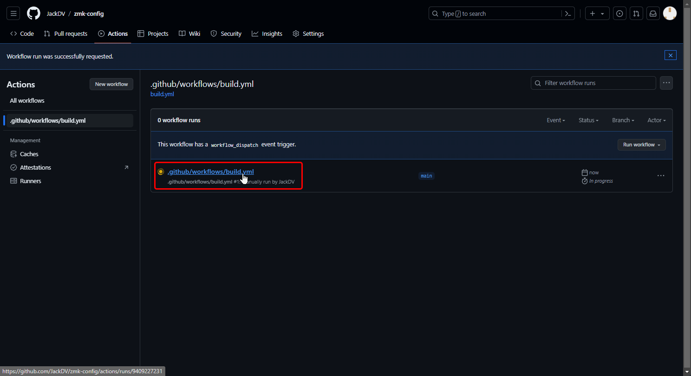

11. Once the compiling is complete, each section will be green, and you will see a download button below. If you do not see the download button, press the back arrow in the top left of the screen, and then click back into the workflow that you just ran.
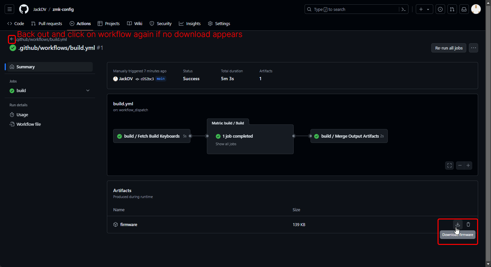

12. Unzip the firmware that downloads, and put it in a safe place while we go to the flashing section.

## Part 4: Flashing
This section is where we will talk about how to flash the firmware you created onto your BakenekoGO. Start by plugging in the PCB to your computer. This **cannot** be done wirelessly.

1. Let's start by putting the PCB into bootloader mode. By doing this, we will allow the PCB to receive the new firmware file. To enter bootloader mode, you can either double press the reset button on the bottom of your PCB while it is plugged in, or by hitting the bootloader keyset combination `Hold FN/Layer Key, tap Enter key`. Below are the default keybindings, as well as the physical reset button location.
2. 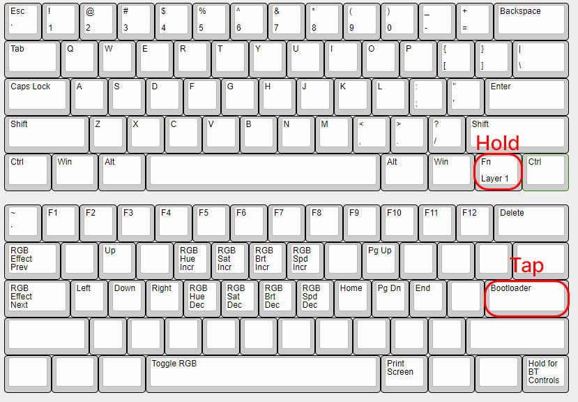
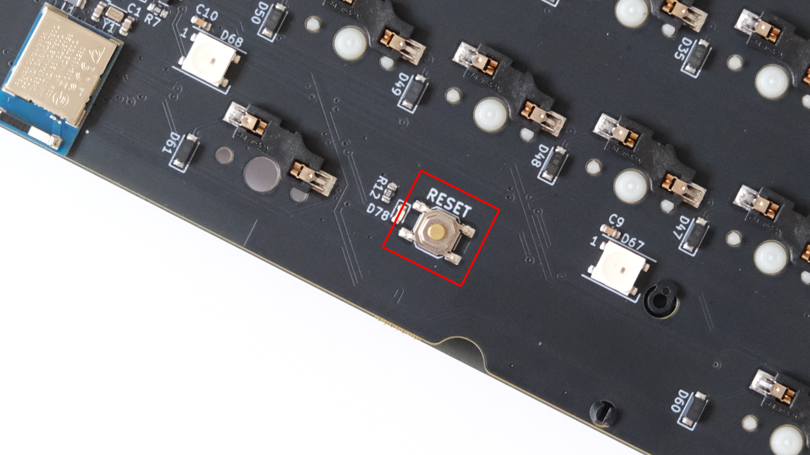

3. If successful, on Windows a folder or drive will pop up immediately on your computer called `Bakeneko60`. This folder represents the storage found on your BakenekoGO PCB, and can be found as a removeable storage in file exporer if accidentally closed. If you are on a Mac, the drive will mount and be visible on your desktop as well as the Finder sidebar as Bakeneko60.
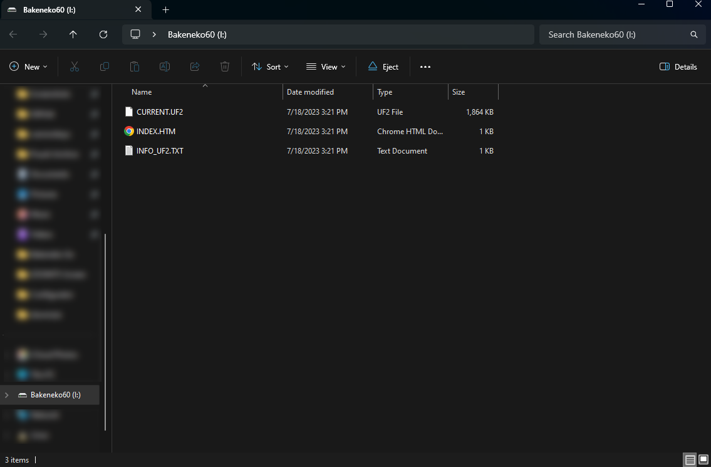

4. To flash, simply drag the **unzipped** firmware from the previous section into the `Bakeneko60` drive/folder. The firmware should be called `bakeneko60_go-zmk.uf2`. If you get an error, unplug your keyboard/PCB, plug it back in, and try again. If successful, the firmware file will copy into the BakenekoGO, the folder will close, and your BakenekoGO will now have your new keymap!
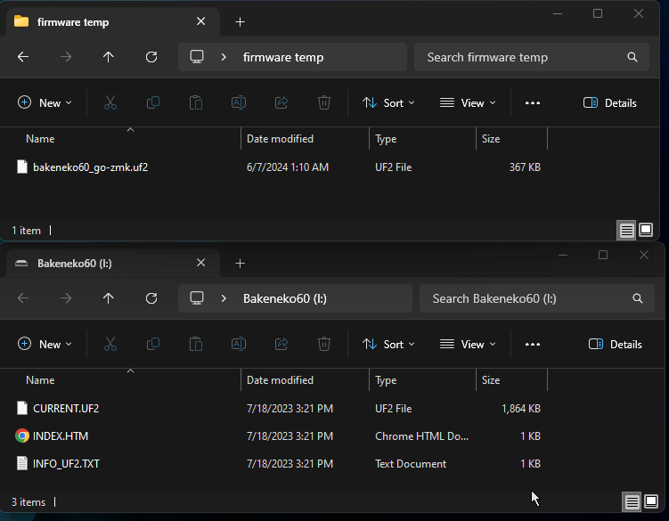
