# Sagittarius Build Guide

First make sure you have all the items needed.
Each kit should include:

* PCB
* Plate
* USB-C Daughterboard
* JST Cable
* Hardware (should be installed already)
* Hex Key (for the Screws)
* Gasket Strips
* 4 x Silicone Feet
* Sagittarius Case

Resources

* [Sagittarius VIA compatible firmware](https://raw.githubusercontent.com/the-via/firmware/master/cannonkeys_sagittarius_via.bin)
    * This is pre-flashed on the PCB so you will likely not need it.
* [VIA download](https://github.com/the-via/releases/releases/tag/v1.3.1)
    * This is the program used to remap keys and control lighting

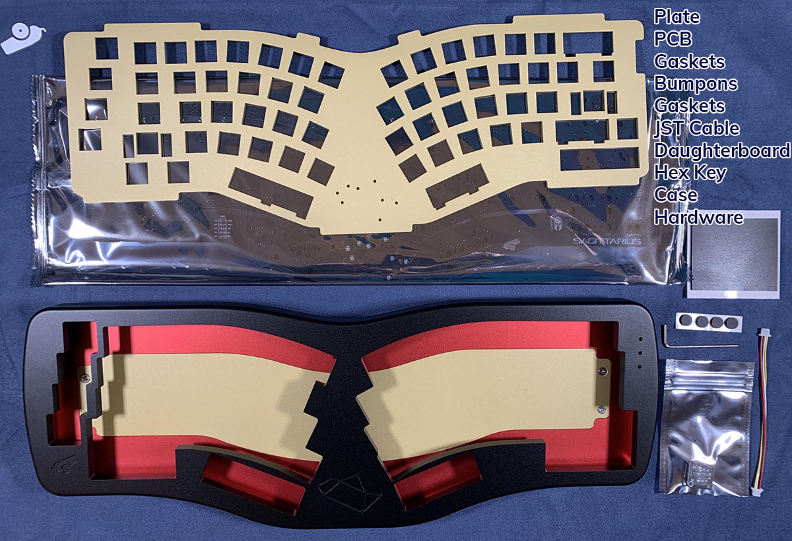

# Preparation

1. Flip the case over onto a soft surface and place bumpons into the cutouts located on the bottom the case.

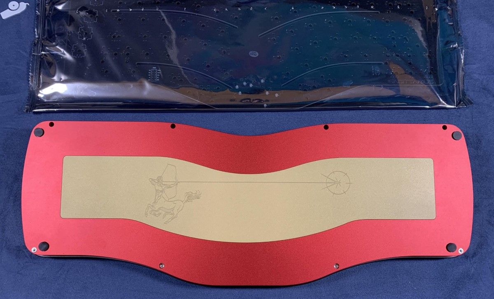
2. Pull the daughterboard out from the baggie, and connect it to the PCB via the included JST Cable. Once the daughterboard and PCB are connected, plug the daughterboard into your computer via a USB-A to USB-C Cable. Using tweezers, test the keyboard using the testing app of your preference (there is one built into via).

!!! Note
    Never tested a PCB with tweezers before? No problem! We have some additional information in our [PCB Basics Doc](https://docs.cannonkeys.com/pcb_basics/#testing-a-pcb).
    
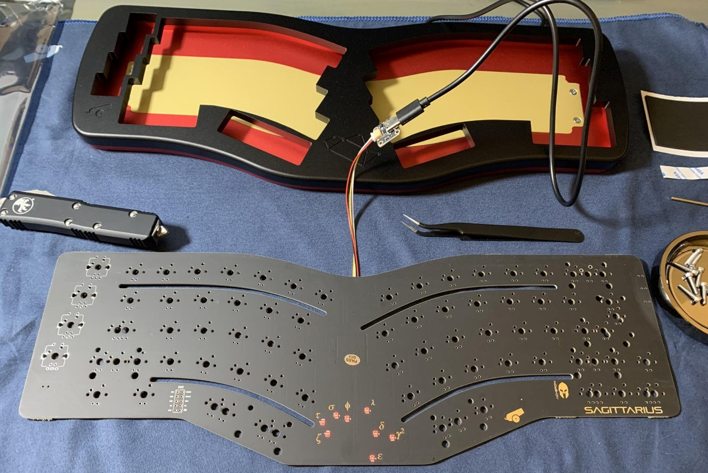
    
# Building

1. Like any other build, assemble/mod/test your stabilizers, and install them to the PCB. Next, install your LED indicators. Finally, install switches into the plate and PCB, then solder.

!!! Note
    If adding indicator LEDs, the long leg on the LED is the positive end, and the square hole (seen on the bottom of the PCB) is where the negative end goes. More information on this is in our [PCB Basics](https://docs.cannonkeys.com/pcb_basics/#pcb-basics) doc. Encoders work with the PCB, however they require custom firmware.

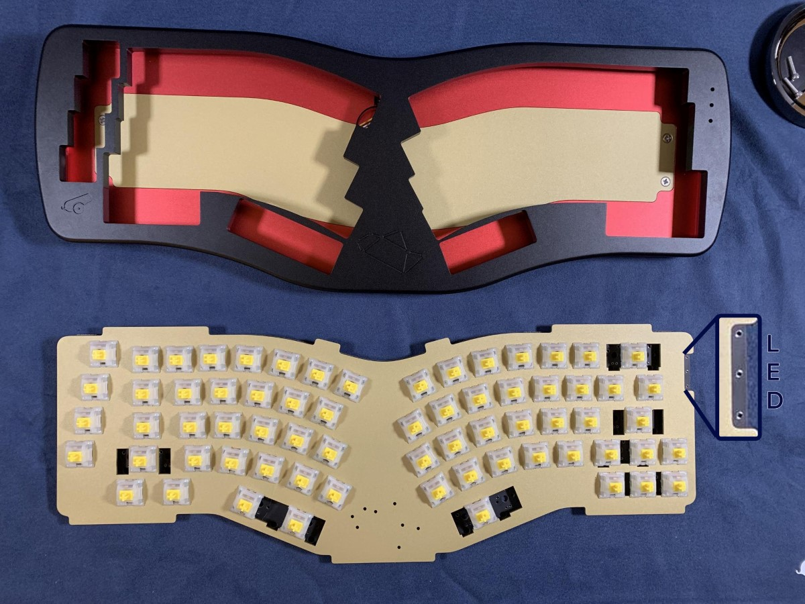
2. Now that your PCB + plate assembly is soldered we can move onto the case! Grab the gasket strips, and start applying them to the top **and** bottom of the case. There are 4 sections of the case that require smaller strips. These 4 pieces can be cut from 1 longer piece, as seen in the image below. Don't worry about perfect placement, as long as the strip is making full contact in the area you should be good to go!

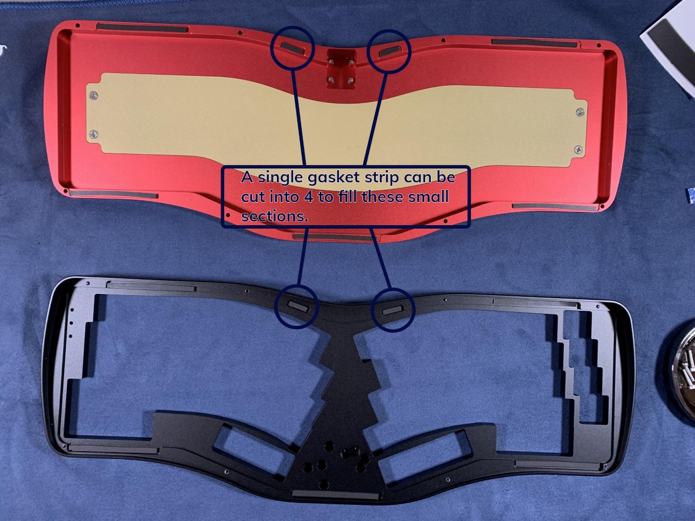
3. Now that gasket strips are installed, grab the JST cable and daughterboard. Remove the daughterboard screws from the case, insert the JST cable into the daughterboard, and screw the daughterboard into the bottom case. 

!!! Note
    It is very important to support the JST header of the daughterboard while inserting the cable. Additionally, make sure you're inserting it as evenly as possible to avoid bending any pins. For more information on this, we have a section in our [PCB troubleshooting guide](https://docs.cannonkeys.com/troubleshooting/#cause-3-looseimproper-connection-on-usb-port-jst-cable-or-jst-header).

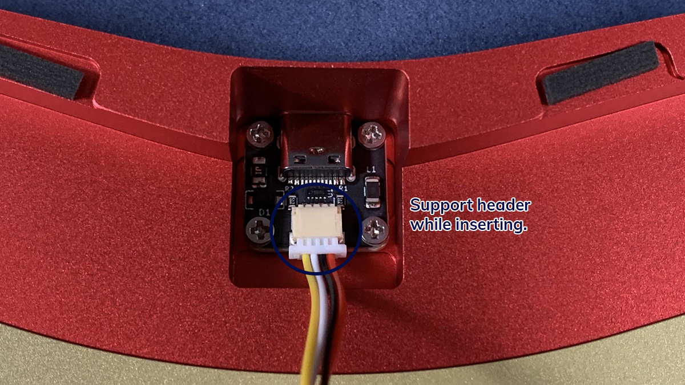
4. Next, attach the JST cable to the header on the PCB, making sure to support the header. 

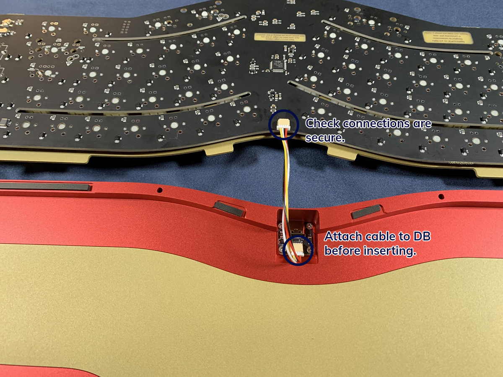
5. Gently place the PCB + plate assembly into the bottom case, making sure to carefully tuck the JST cable below the PCB. The plate should be sitting on the gaskets evenly, and wire tucked below PCB.

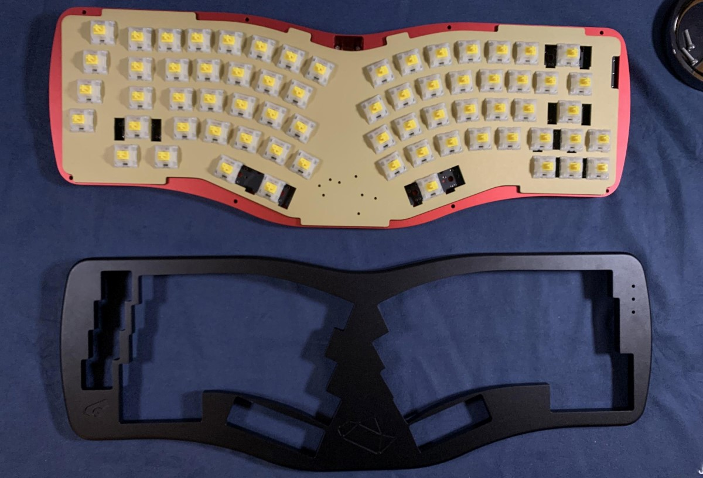
6. Place top case onto the bottom case, and gently flip over the keyboard. Using the included hex key or a thin screwdriver, screw together the top and bottom case.

!!! Note
    When screwing together the case, the amount you tighten each screw and how evenly you tighten them will potentially affect the sound and feel of the board. Generally we recommend starting off not fully tightening the case, and playing around with the tightness a bit until you achieve the sound and feel you are looking for.

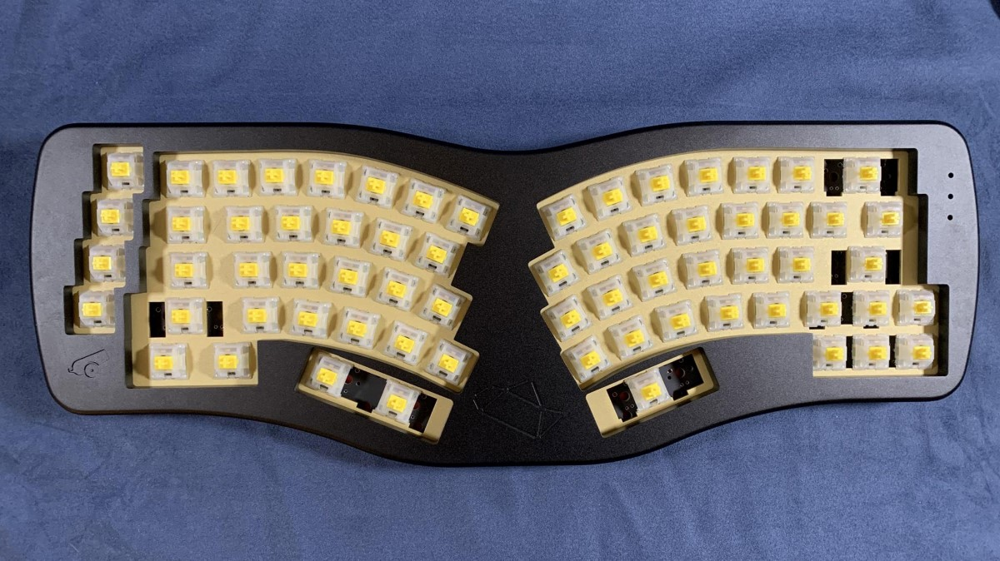 
7. Flip over the keyboard and add your keycaps. You should now be able to plug in your board to be used!

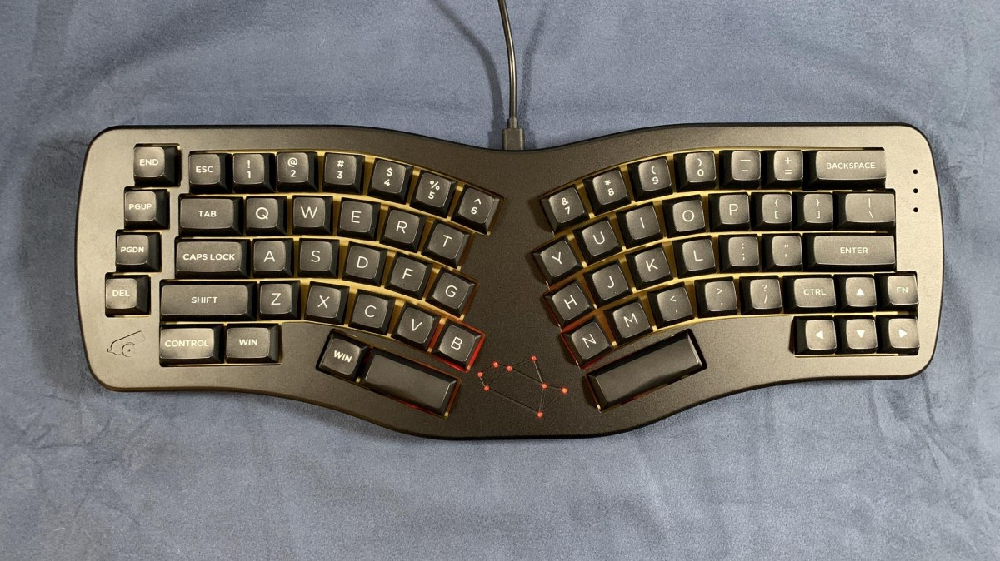 

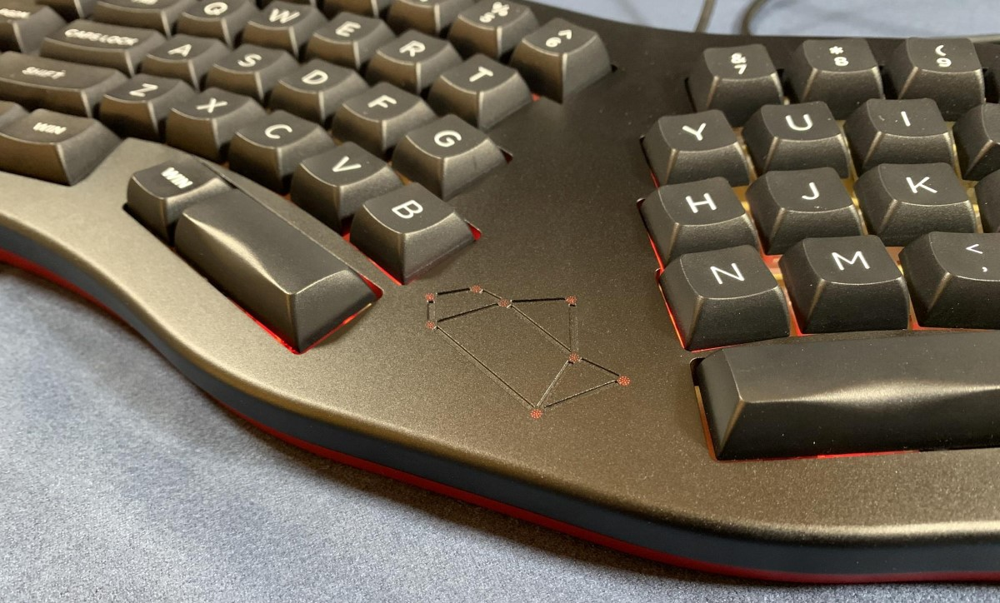 

# Using your Sagittarius

Sagittarius works out of the box with [VIA](https://www.caniusevia.com/), which is the recommended software for any key rebinding. To control the constellation LED array, you can either use hotkeys to control it by editing the keymap, or by using the lighting section of VIA found in the left side of the interface.
