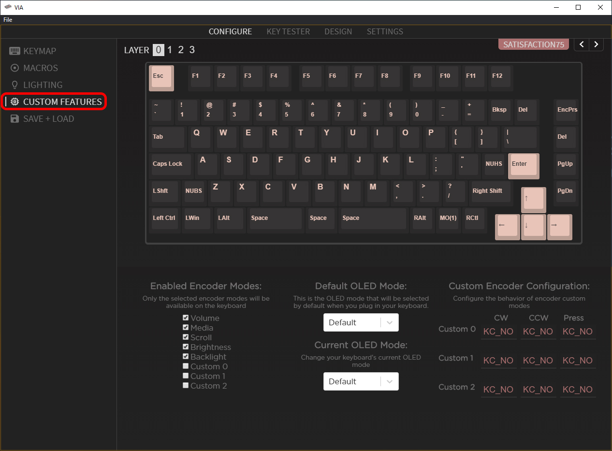
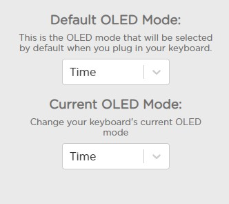
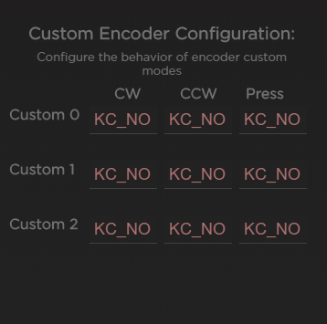

# Using your Satisfaction75

There are a number of features built in to the Satisfaction75 that aren't usually present in keyboards. Here is how to use them!

## Encoder

The Satisfaction75 is built around two primary things - the encoder and OLED. The OLED will show you what mode the encoder is operating in. Each mode has a different action for the encoder to do depending on whether it goes clockwise, counterclockwise, or is pressed. These modes are enumerated in the table below:

| Mode Name   | OLED Indicator | Clockwise            | Counterclockwise       | Press            |
|-------------|----------------|----------------------|------------------------|------------------|
| Volume      | VOL            | Volume Up            | Volume Down            | Mute             |
| Media       | MED            | Next Track           | Previous Track         | Play/Pause       |
| Scroll      | SCR            | Mouse Wheel Down     | Mouse Wheel Up         | None             |
| Brightness  | BRT            | Screen Brightness Up | Screen Brightness Down | None             |
| Backlight   | BKL            | Backlight Increase   | Backlight Decrease     | Toggle Breathing |
| Custom Mode | CS#            | Defined in VIA       | Defined in VIA         | Defined in VIA   |

There are 3 custom modes. They are configurable by VIA to do any action that QMK can handle.

To change modes, **hold FN + turn the encoder knob**.

## OLED Screen

The OLED screen has a 3 different modes. You can toggle between them using **FN + Pressing the encoder**.

* Default Mode - This mode shows a matrix readout visualization, modifier highlights, layer indicators, the time, caps and scroll lock indicators, and encoder mode indicator.
* Time Mode - This mode shows the date and time, as well as the encoder mode, layer indicator, and CAPS lock indicator.
* OFF Mode - Sometimes you don't want to see your OLED, so you can turn it off.

## Clock Setting

In order to set the clock, we have to enter CLOCK setting mode. In order to do so, press **FN + the key directly below the knob**.

In clock setting mode, you will see part of the date/time underlined. Turning the knob will change this value. Pressing the knob will advance the underline to the next part of the date/time.

When done setting the time, press **FN + the key directly below the knob** to exit the clock setting mode, and lock-in the time.

## VIA Support

You can use [VIA Configurator](https://github.com/olivia/via-config/releases) to configure your Satisfaction75 keyboard. It's a nice and intuitive way of setting up your keymaps. MechMerlin has made a cool demo of the VIA software available [here](https://www.youtube.com/watch?v=sAUO7_Ts4Pw)

In addition to that, there is a special menu, made specifically for the Satisfaction75. From the default view, hit the "CUSTOM" header:

From there, you can control the enabled encoder modes and default OLED mode:

To set a custom encoder behavior, you can use this chart:

Each box controls a different behavior in the custom encoder mode, and can be defined with a QMK keycode.
