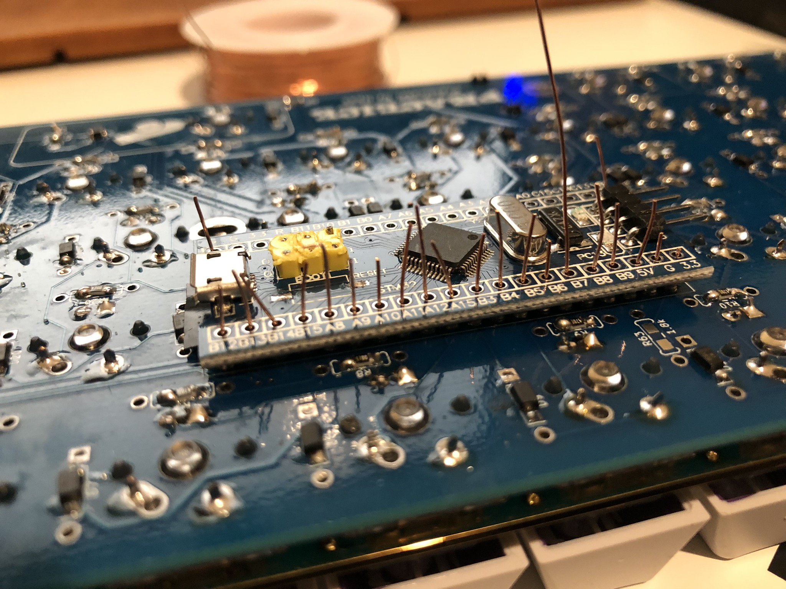
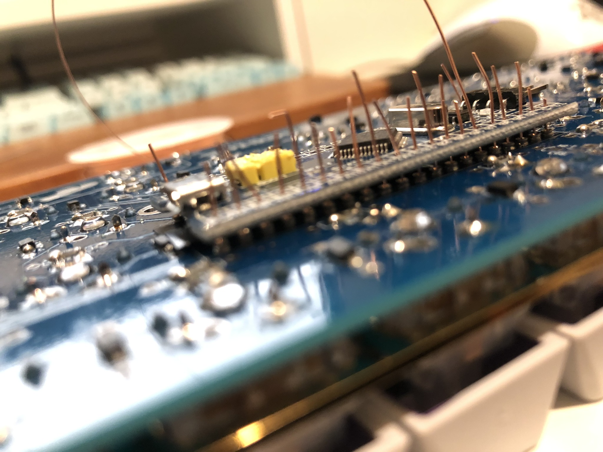
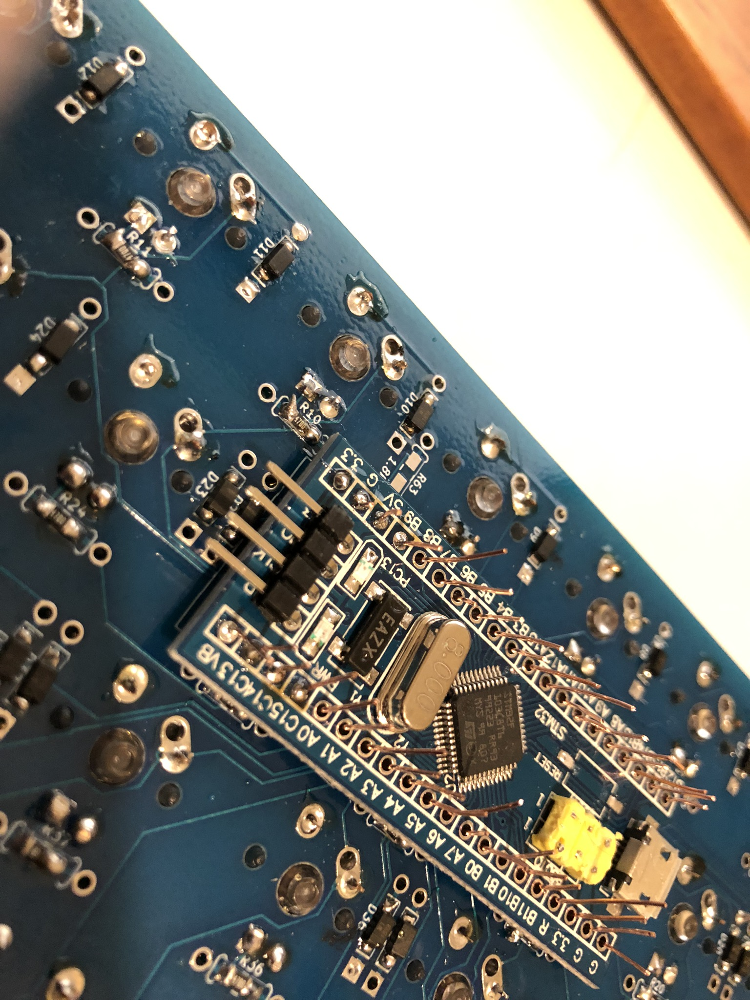
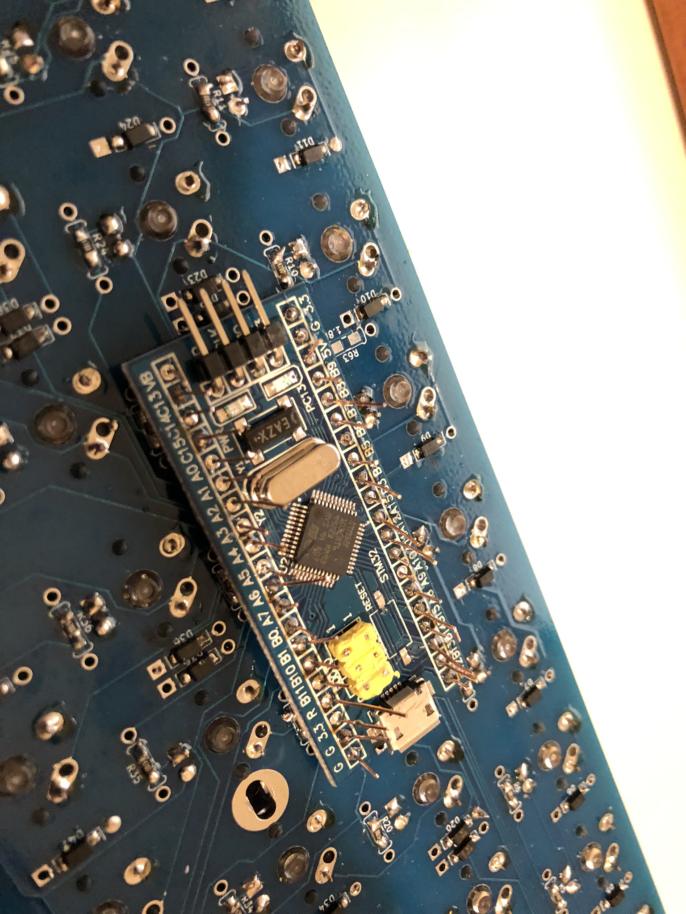
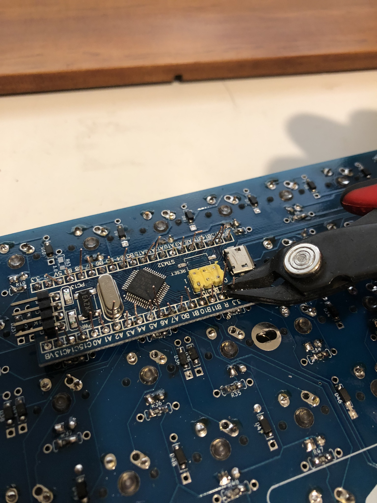

# Low-profile Socket Installation

!!! Note
    Some of these photos were taken using a Pro Micro based Luddite board. The same steps apply, just on your blue pill based board! You have 20 spots on each side, not 12.

## Installing the Sockets

1. Our low profile peel-a-way sockets have 40 spots. First we need to cut them down into 2 strips of 20.

1. Once our sockets are cut, insert the pins into the appropriate holes on the backside of the board.

1. Flip your PCB back around, making sure the sockets stay in their holes.

1. Solder the pins to the board

## Installing the BluePill
1. Align the Blue Pill with the sockets. Then one-by-one, insert a piece of wire or diode leg into each pin. Make sure your pins go all the way into the sockets!

1. Once all pins are inserted, start soldering the pins to the Blue Pill.

1. Finish soldering all the pins to the BluePill.

1. Carefully cut all the extra wire/diode legs off of the Blue Pill.

1. At the end, your BluePill should look like this.
