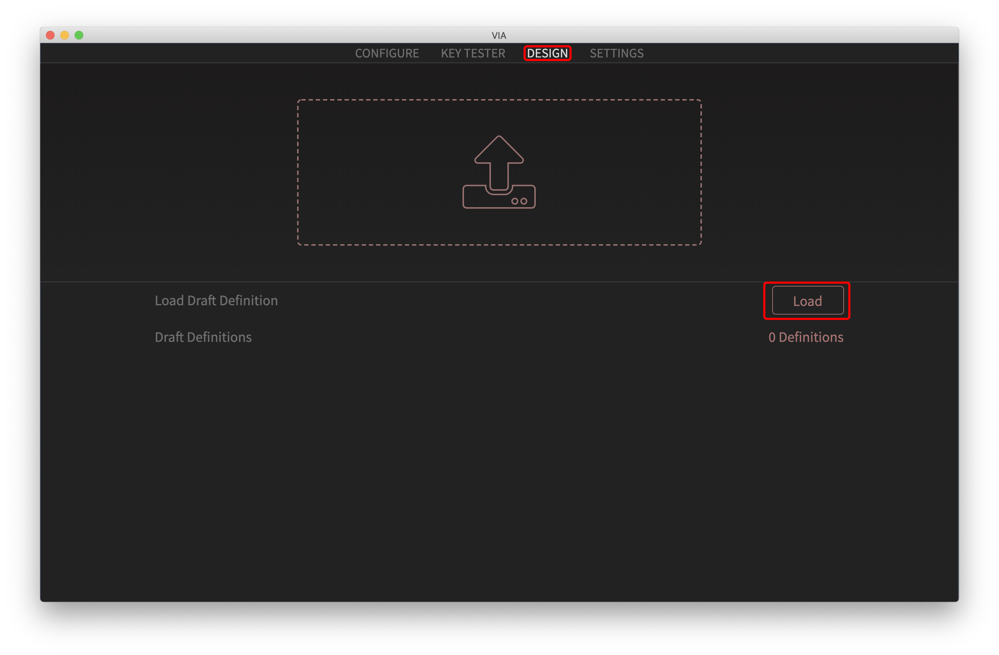
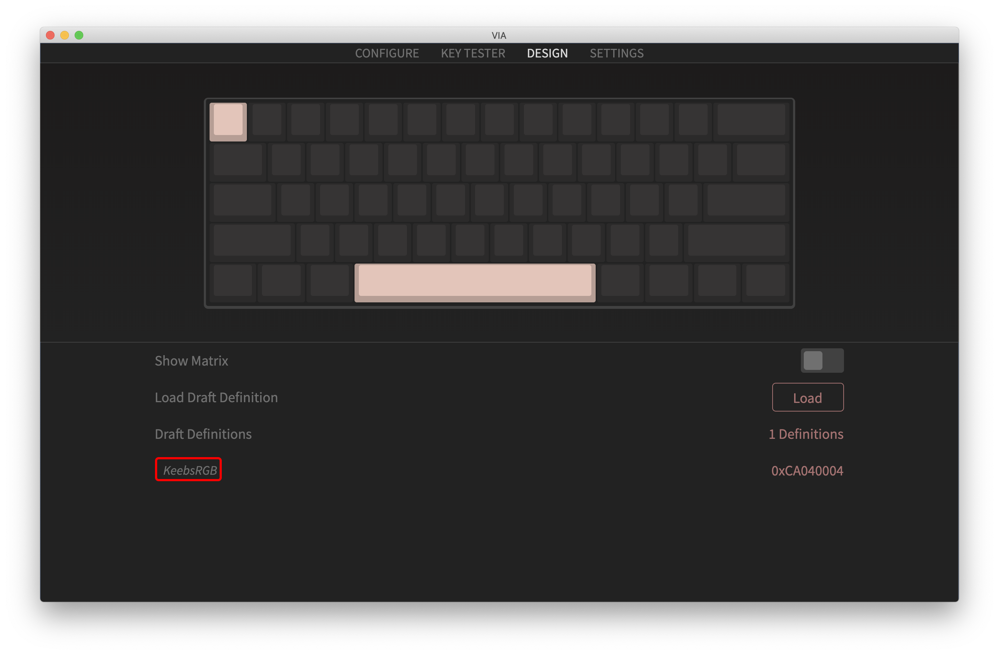
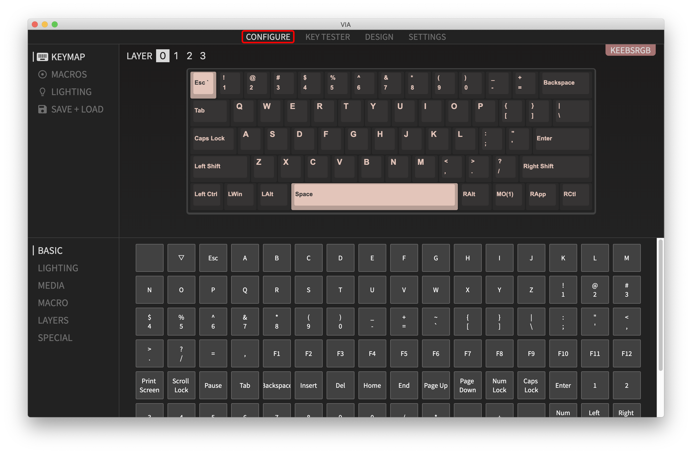
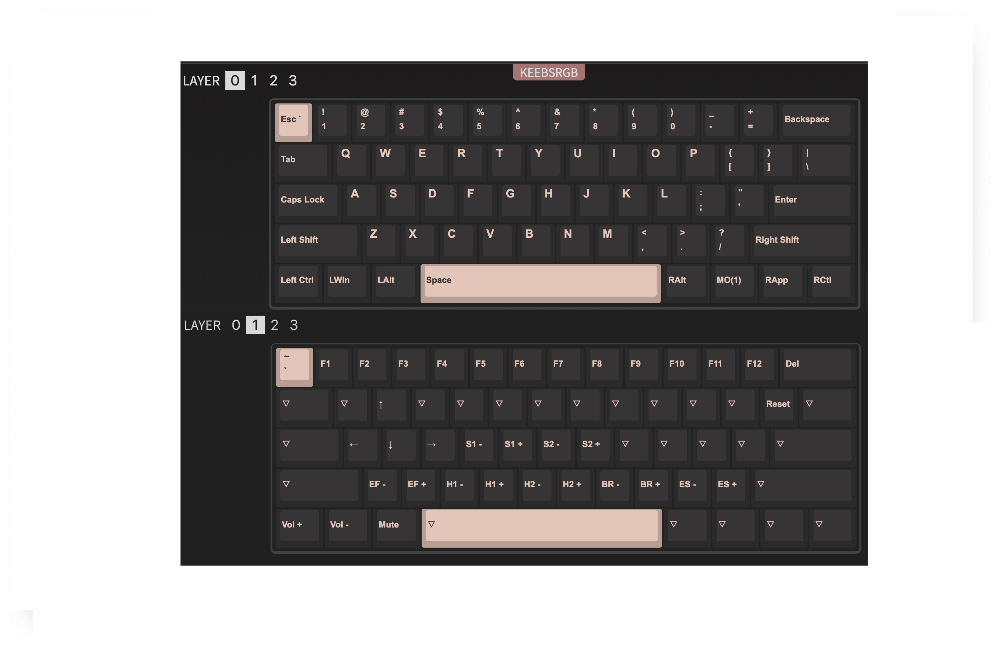

## VIA .json Loading Guide
Occasionally a keyboard has support for VIA, but has not yet been added into the official VIA database. To get around this, a .json can be used to give VIA the data needed for remapping.

---
### Links and downloads for this guide

 - [VIA latest download](https://www.github.com/the-via/releases/releases/latest)
 - [Keebs RGB PCB .json](assets/keebsrgb.json) 
 - [Onyx .json](assets/onyx.json)
 - [Vicious40 .json](assets/vicious40.json)
 - [Malicious Ergo .json](assets/malicious_ergo.json)
!!! Note
    If you are using this guide for a different PCB, you will need the .json for that specific keyboard

---

**Step 1: Open VIA**

 - Open VIA
 - On the top right of the VIA interface, press the settings tab
 - Toggle the show design tab
 - Click the new design tab, and load in the .json you downloaded
 
 

**Step 2: Load the .json**
 - Once the file has been selected, open it in VIA.
 - Your page should now look like this:

**Step 3: Click the configure tab in the top left**

 - Once the .json has been loaded, click the configure tab and you should see your keyboard with the correct keymap
 - You are now ready to remap your keyboard!

 

**Bonus Steps**

 - To view different layers, click on the layer button in the top left of the interface to navigate between all your layers. You can only view one layer at a time.
 - To change lighting effects and colors, click the lighting tab in the bottom left of the interface.

